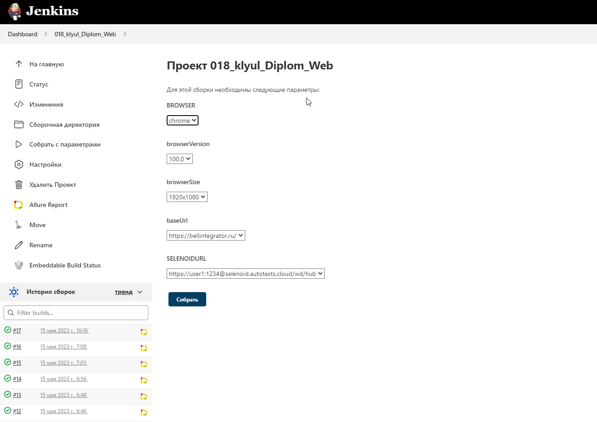
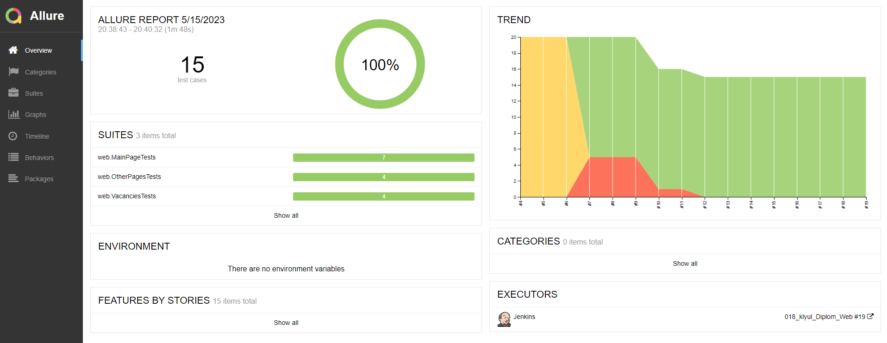
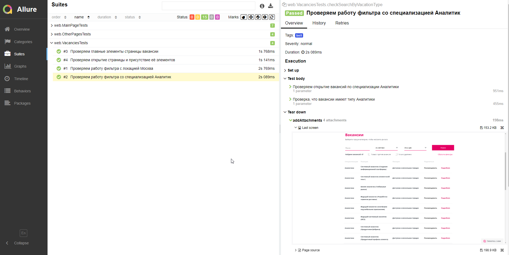
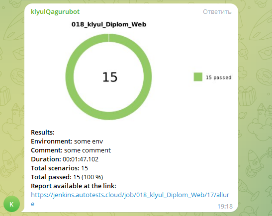
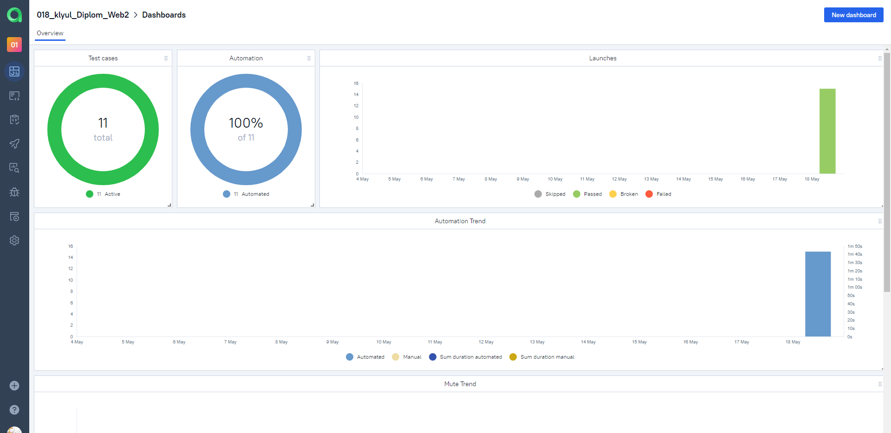
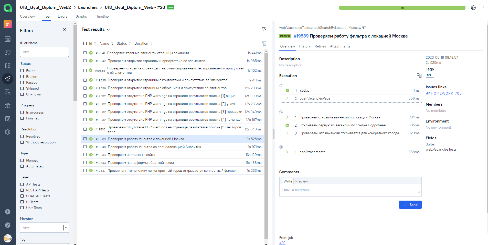
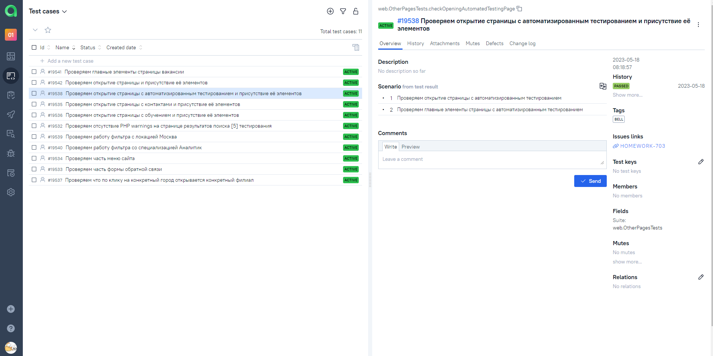
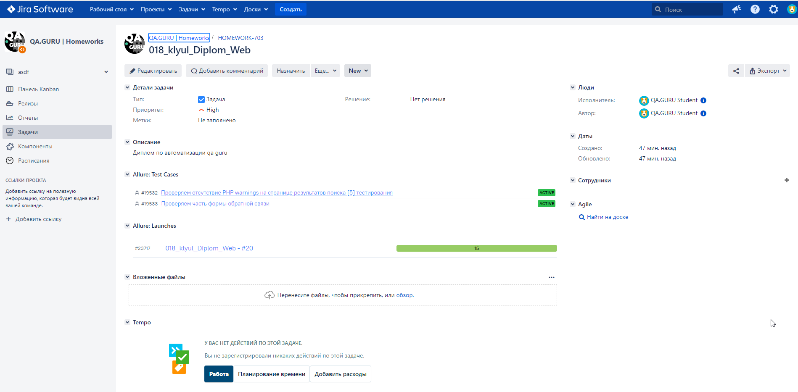

# Проект по автоматизации тестирования для Bell Integrator
<a target="_blank" href="https://bellintegrator.ru/">Cайт Bell Integrator</a>

<image src=https://bellintegrator.ru/catalog/view/theme/bellOne/image/logo_BellIntegrator_rus.svg>

## :pushpin: <a id="list"></a> Содержание:

* <a href="#tools">Технологии и инструменты</a>

* <a href="#cases">Реализованные проверки</a>

* <a href="#console">Запуск из терминала</a>
  
* <a href="#jenkins">Сборка в Jenkins</a>

* <a href="#allure">Allure отчеты</a>

* <a href="#telegram">Отчёт в Telegram</a>

* <a href="#testops">Интеграция с Allure TestOps</a>

* <a href="#jira">Интеграция с Jira</a>


## :hammer_and_wrench: <a id="tools"></a> Технологии и инструменты
<p align="center">
<a href="https://www.jetbrains.com/idea/"></a>
<a href="https://www.java.com/"></a>
<a href="https://github.com/"></a>
<a href="https://junit.org/junit5/"></a>
<a href="https://gradle.org/"></a>
<a href="https://selenide.org/"></a>
<a href="https://aerokube.com/selenoid/"></a>
<a href="https://github.com/allure-framework/allure2"></a>
<a href="https://www.jenkins.io/"></a>
</p>


## :scroll: Реализованные проверки
* Проверка главного меню страницы.
* Проверка формы обратной связи.
* Проверка страницы с результатами поиска.
* Проверка страницы с обучением.
* Проверка фильтров с вакансиями.

## :computer: Запуск из терминала
```bash
 gradle clean autotest_bell_remote
```

## <a href="https://www.jenkins.io/"></a> Сборка в [Jenkins](https://jenkins.autotests.cloud/job/018_klyul_Diplom_Web/)

Для запуска сборки необходимо перейти в раздел <code><strong>*Собрать с параметрами*</strong></code> и нажать кнопку <code><strong>*Собрать*</strong></code>.
<a href="https://jenkins.autotests.cloud/job/018_klyul_Diplom_Web/#"></a>
<p align="center">
</p>


## <a href="https://github.com/allure-framework/allure2"></a> Allure отчеты
:information_source: По итогам сборки в Jenkins собирается отчет в Allure Report
> Для просмотра необходимо залогиниться в Jenkins
* Подключено добавление в отчет:
    - последнего скриншота
    - ресурсов страницы
    - логов браузера
    - видео прохождения тестов
<p align="center">


</p>


## Отчёт в Telegram 
После завершения сборки специальный бот, созданный в <code>Telegram</code>, автоматически обрабатывает и отправляет сообщение с отчетом о прогоне тестов.

<p align="center">


##   
##  Интеграция с [Allure TestOps](https://allure.autotests.cloud/project/2279/launches)

### Основной дашборд
<p align="center">

</p>

### Список тестов с результатами прогона

<p align="center">
  
</p>

### Тест-кейсы

<p align="center">
  
</p>


##  Интеграция с [Jira](https://jira.autotests.cloud/browse/HOMEWORK-703)
:information_source: Настроена интеграция Allure TestOps с Jira.
Тест-кейсы и результаты прогонов можно прикреплять к необходимым задачам.


